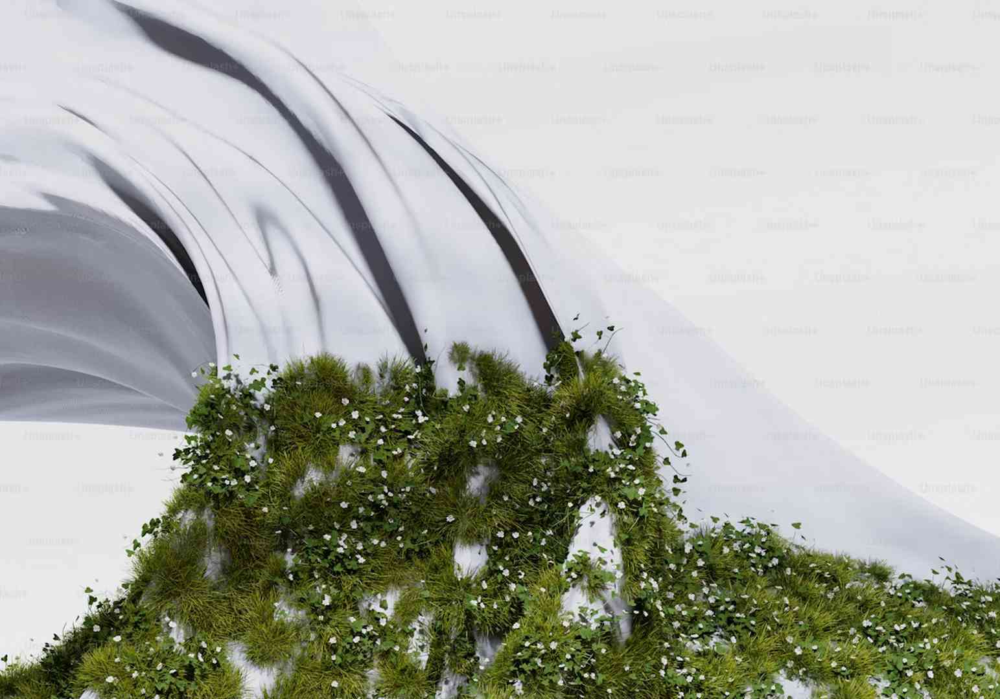

Presentazione di un minimo di 1500 battute eventualmente suddiviso in più paragrafi, non eccessivamente corti.

Concentrarsi sulle tematiche trattate. I dettagli tecnici possono essere indicati meglio nelle didascalie delle immagini seguenti (almeno 3 e non più di 6, di almeno 1920x1080px).

Per questo e per gli altri campi. si possono vedere i sorgenti nelle sottocartelle di "content" nel repository GitHub [belluscio-abafr/selezione-tesi](https://github.com/belluscio-abafr/selezione-tesi) e sul sito [Selezione di tesi dell'Acccademia di Frosinone](https://belluscio-abafr.github.io/selezione-tesi/)

*Descrizione più estesa, ma non troppo, del contenuto dell'immagine (mantenendo l'asterisco iniziale e finale).*

*ad esempio: Proiezione di pattern luminosi su una facciata architettonica durante l'installazione.*

*Sistema di sensori di movimento integrati nell'installazione per rilevare la presenza del pubblico e modificare la generazione dei pattern.*

