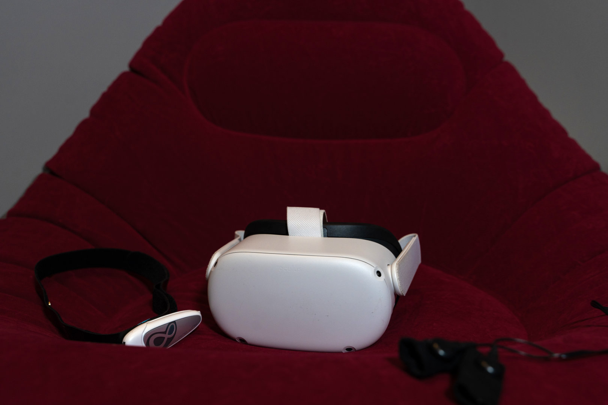
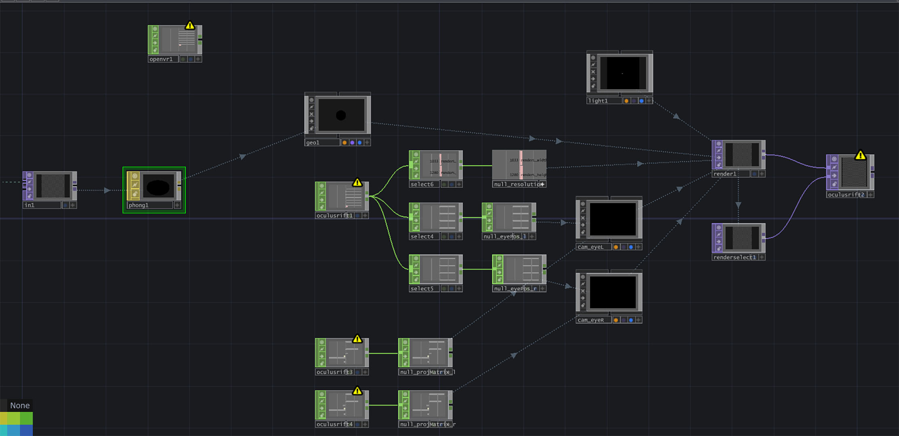

Noxium è un'installazione di realtà virtuale che trasporta l'utente in un viaggio immersivo attraverso il mondo onirico, ispirato agli archetipi junghiani. Il progetto esplora la relazione tra tecnologia, psicologia e arte, creando un'esperienza sensoriale totale che si adatta in tempo reale allo stato emotivo e fisiologico del partecipante.

L'installazione utilizza due sensori biometrici: un sensore GSR (Galvanic Skin Response) che misura la conduttanza cutanea legata all'attivazione emotiva, e una fascia EEG che monitora le onde cerebrali. I dati raccolti determinano se l'utente vivrà un'esperienza onirica positiva (sogno) o negativa (incubo), selezionando tra i dodici archetipi junghiani - dal Saggio all'Orfano, dall'Eroe al Ribelle.

Le immagini vengono generate in tempo reale tramite Stream Diffusion, un modello di intelligenza artificiale che trasforma prompt testuali basati sugli archetipi in visioni oniriche. Parallelamente, paesaggi sonori binaurali creati attraverso field recording e sintesi audio accompagnano l'esperienza, con suoni che si spazializzano in 3D seguendo i movimenti del visore VR.

*TouchDesigner funge da cervello centrale del sistema, integrando i flussi di dati dai sensori, gestendo la generazione delle immagini e coordinando l'audio spaziale. I valori GSR tra 0-500 attivano i prompt positivi, mentre valori tra 501-1023 selezionano gli incubi. Le onde cerebrali EEG influenzano invece parametri come la nitidezza e lo stile delle immagini generate.*

Noxium rappresenta una fusione tra arte digitale e psicologia analitica, offrendo non solo un'esperienza estetica ma anche un strumento di esplorazione interiore. Il progetto dimostra come la tecnologia possa diventare un ponte verso l'inconscio, trasformando dati fisiologici in narrazioni visive e sonore profondamente personali.

*L'installazione completa con poltrona, visore VR Meta Quest 2, sensore GSR e fascia EEG.*

*Il network in TouchDesigner che gestisce l'integrazione con Stream Diffusion per renderlo un mondo per VR.*

*Immagine generata da Stream Diffusion per l'archetipo del Saggio in modalità "incubo", creata durante una sessione con utente agitato (valori GSR alti).*

*Immagine generata da Stream Diffusion per l'archetipo del Saggio in modalità "sogno", creata durante una sessione con utente rilassato (valori GSR bassi).*

