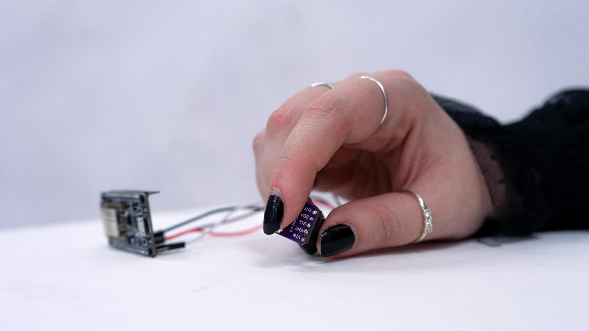

Enantios è un’opera immersiva che nasce dall’incontro tra arte, scienza e tecnologia. Il progetto esplora il rapporto tra due forze opposte: caos ed ordine, indagando come le complessità emotive, spesso percepite come caotiche, possano trasformarsi in un percorso di scoperta di un ordine interiore.

L’opera propone un dialogo tra razionalità e incertezza, mostrando come il caos non sia semplice disordine, ma un’opportunità per generare equilibrio e armonia, immergendo lo spettatore in un’esperienza sensoriale e riflessiva.

La dinamica tra caos e ordine si fonda sulla teoria del caos, introdotta da Edward Lorenz con l’attrattore di Lorenz, che mostra come sistemi complessi apparentemente caotici possano seguire schemi ordinati. Applicata all’arte, questa prospettiva trasforma concetti astratti in esperienze concrete e accessibili, stimolando percezione visiva, sonora ed emotiva.

L’opera è interattiva: sensori del battito cardiaco e della conduttività magnetica coinvolgono due partecipanti, simbolizzando la connessione tra emozioni diverse. Ho sviluppato un sistema personale basato su caos, ordine e variabili: il caos genera variazioni imprevedibili, l’ordine stabilizza il flusso e le variabili modulano il comportamento complessivo.

Il flusso sonoro, composto da tre eventi spazializzati in Reaper, e la visualizzazione interattiva tramite point cloud in TouchDesigner rispondono in tempo reale ai dati biometrici. L’interazione del pubblico genera nuove esperienze, trasformando l’arte generativa in uno strumento di scoperta, dialogo e connessione con sé stessi e con gli altri.

Per questo e per gli altri contenuti, si possono vedere i sorgenti delle sottocartelle di "content" nel repository GitHub https://github.com/belluscio-abafr/galleria-corsi mentre la modalità di visualizzazione si può osservare sul sito https://belluscio-abafr.github.io/galleria-corsi.

Nel caso servisse... la sintassi del front matter (la prima parte di questa pagina delimitata dai 3 trattini) fa riferimento al linguaggio YAML. Il testo e i riferimenti alle immagini seguono la sintassi del linguaggio Markdown. Per omogeneità è comunque meglio limitarsi a un testo senza formattazioni seguito da tre o più immagini.

*rilevazione del valore numerico del battitocardiaco attraverso il contatto con le dita (mantenendo l'asterisco iniziale e finale).*

*Sensore della conduttività magnetica collegato ad un microcontrollore.*

*sensore del battito cardiaco collegato ad un microcontrollore.*

