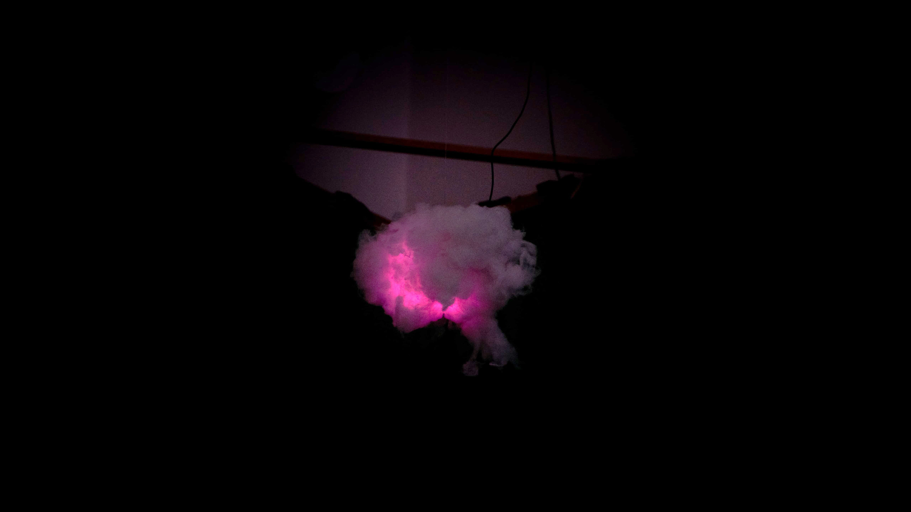
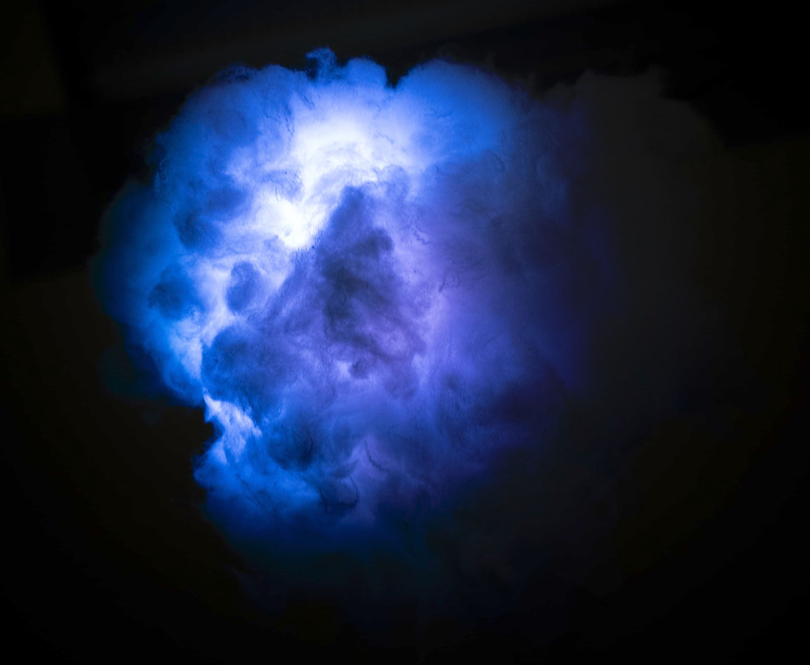

Nubia Mentis è un’installazione interattiva che esplora la mente come paesaggio emotivo e sensoriale. Il progetto nasce dal desiderio di rendere visibili stati d’animo, pensieri e flussi interiori attraverso la combinazione di luce, colore e suono. Tre nuvole sospese rappresentano tre stati emotivi differenti — ansia, tristezza e felicità — ciascuna caratterizzata da una propria palette cromatica, da un suono e da un testo distintivo. L’opera invita lo spettatore a confrontarsi con la propria interiorità, scegliendo liberamente sotto quale nuvola sostare e sperimentando una relazione diretta tra il proprio stato d’animo e la risposta sensoriale dell’installazione.

Il funzionamento generale dell’opera si basa sull’interazione tra LED e suoni: i colori all’interno di ogni nuvola cambiano in tempo reale in risposta alle variazioni sonore. Ogni nuvola contiene un altoparlante e un sistema di LED programmato tramite Arduino, che traduce le variazioni del suono in modifiche cromatiche e ritmiche. La prima nuvola, dedicata all’ansia, si illumina con toni freddi e intermittenti, in un ritmo irregolare che restituisce tensione e inquietudine. La seconda, legata alla tristezza, adotta tonalità più profonde e movimenti lenti, suggerendo malinconia. La terza nuvola, simbolo di felicità, si accende con colori caldi e pulsazioni luminose vivaci, accompagnate da suoni più aperti e gioiosi.

 Nubia Mentis ha un linguaggio poetico e simbolico: luce e suono diventano strumenti per dare forma all’invisibile e tradurre l’emozione in percezione. L’opera ha suscitato un coinvolgimento personale nei visitatori, che si sono fermati sotto la nuvola più vicina al proprio stato d’animo, scoprendo come la tecnologia possa generare empatia e riflessione. Ogni sosta sotto di esse ha prodotto interpretazioni uniche, confermando l’importanza dell’apofenia nel costruire significati personali. Nubia Mentis dimostra che l’arte non mostra solo ciò che è visibile, ma rende percepibile ciò che di solito rimane nascosto, trasformando l’interiorità in un’esperienza condivisa e luminosa. 

*Ansia espressa tramite luci, suoni e  colori come il rosso e il viola.*

*[ritoccato con filtro "Livelli"]*

*Tristezza espressa tramite luci, suoni e varie sfumature del blu.*

*Felicità espressa tramite luci, suoni e varie sfumature dal bianco al giallo.*

 
