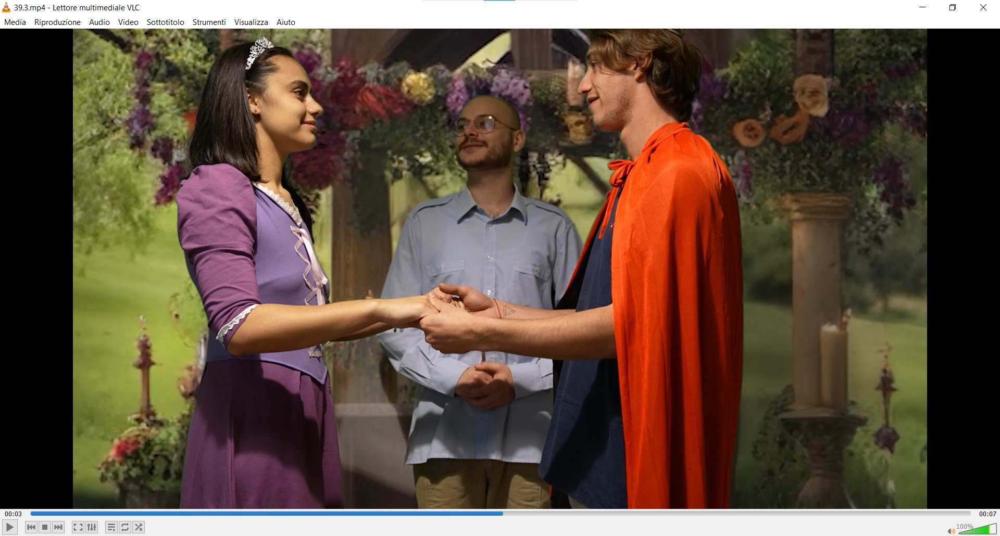
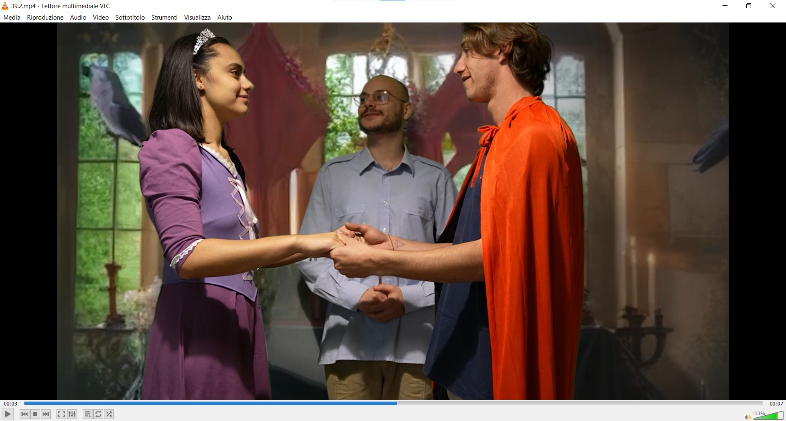
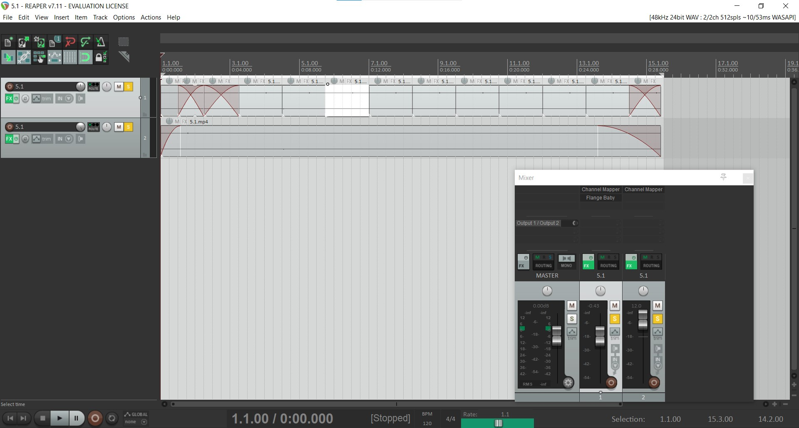
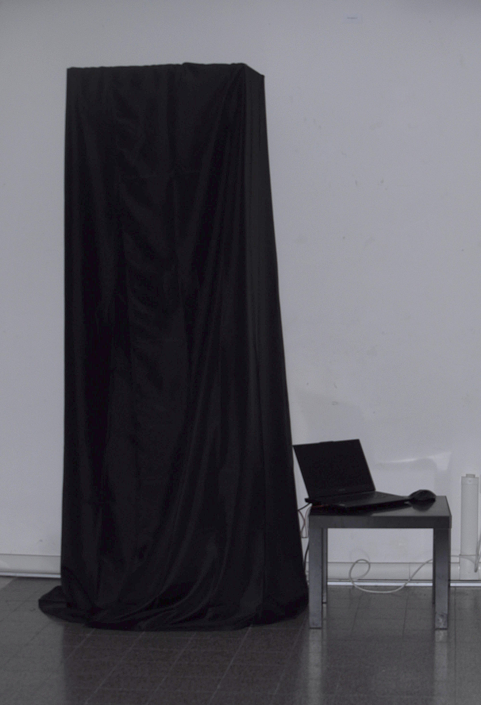

Presentazione di almeno 1200 battute (spazi inclusi) e non oltre 2000. Il testo può essere suddiviso in più paragrafi non troppo corti, come questo.

Possibile traccia: 
- introdurre e spiegare le tematiche trattate;
- descrivere il funzionamento generale (i dettagli tecnici possono essere indicati nelle didascalie delle immagini seguenti);
- concludere con eventuali riflessioni sui risultati del progetto.

L’opera nasce da una riflessione sui prodotti visivi che quotidianamente consumiamo e sulla ripetitività delle loro strutture narrative. Ogni storia segue uno schema ricorrente: un equilibrio iniziale viene infranto, l’eroe intraprende un viaggio e infine ristabilisce l’armonia perduta.
Il progetto mira a restituire, in senso metaforico e fisico, la sensazione di “schiacciamento” generata dal continuo remix di contenuti che, pur apparendo diversi, risultano sostanzialmente uguali. Nasce così il desiderio di indagare la ripetizione e la fusione degli elementi narrativi, prendendo come riferimento le fiabe, dalla loro forma scritta a quella visiva.
Dopo una ricerca sulle similitudini tra le fiabe, i loro punti essenziali sono stati estratti e ricreati. Con l’aiuto dell’intelligenza artificiale, in particolare tramite TouchDesigner e il nodo Stream Diffusion, sono stati realizzati gli sfondi in movimento, successivamente utilizzati per comporre l’installazione.
L’opera si presenta come un’installazione interattiva: lo spettatore è invitato a entrare in uno spazio raccolto, delimitato da tende, dove i video vengono riprodotti in modo casuale. La struttura in legno, volutamente stretta e chiusa, amplifica la sensazione di oppressione. Un monitor, posto sopra la testa dell’osservatore, accentua l’idea di schiacciamento, mentre due woofer — uno sotto i piedi e uno sopra la testa — rinforzano la verticalità dell’esperienza sonora.
Salendo un gradino per accedere all’interno, lo spettatore è portato a guardare verso l’alto, mantenendo una posizione scomoda per il tempo che desidera. I video, proiettati in loop casuale, rappresentano le scene più iconiche delle fiabe — dal lancio della maledizione al bacio del lieto fine — che invitano a riconoscere e riflettere sulla ripetizione dei racconti visivi contemporanei.

*Per ogni tipologia di video è presente più di uno sfondo.*

*Per gli audio sono state create più versioni di una stessa traccia, con l'aiuto di Reaper.*

*La struttura dell'installazione.*